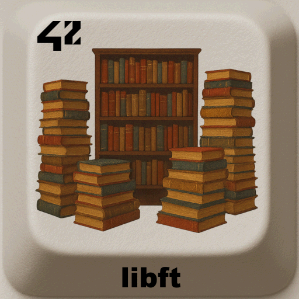

<div align="center">
  <h2>libft - 42 project</h2>
  
  <br>
</div>


> `libft` is the very first project of the **École 42** curriculum.  
> The goal is to create a personal **C standard library**, by reimplementing standard functions and adding utility functions for future projects.

---

## 📖 Table of Contents
- [Description](#-description)
- [Features](#-features)
- [Installation](#%EF%B8%8F-installation)
- [Usage](#-usage)
- [Project Structure](#-project-structure)
- [Examples](#-examples)
- [Roadmap](#-roadmap)
- [Credits](#-credits)
- [License](#-license)

---

## 📝 Description
The **libft** project consists of coding a library of essential C functions,  
which will then be reused in almost every other 42 project.  

This library includes reimplementations of standard C functions (from `<ctype.h>`, `<string.h>`, etc.)  
as well as additional utility functions (linked lists, memory handling, string manipulation…).

---

## ✨ Features
List of functions:

### 🔤 Character checks & conversions
- `ft_isalpha`, `ft_isdigit`, `ft_isalnum`, `ft_isascii`, `ft_isprint`
- `ft_tolower`, `ft_toupper`

### 🧵 String functions
- `ft_strlen`, `ft_strlcpy`, `ft_strlcat`
- `ft_strncmp`, `ft_strchr`, `ft_strrchr`, `ft_strnstr`
- `ft_strdup`, `ft_strjoin`, `ft_strtrim`, `ft_split`
- `ft_substr`

### 💾 Memory functions
- `ft_memset`, `ft_memcpy`, `ft_memmove`
- `ft_memchr`, `ft_memcmp`
- `ft_bzero`, `ft_calloc`

### 🔢 Conversions
- `ft_atoi`, `ft_itoa`

### 🖊 File descriptors
- `ft_putchar_fd`, `ft_putstr_fd`, `ft_putendl_fd`, `ft_putnbr_fd`

### 🔗 Linked list utilities (bonus part)
- `ft_lstnew`, `ft_lstadd_front`, `ft_lstadd_back`
- `ft_lstsize`, `ft_lstlast`
- `ft_lstdelone`, `ft_lstclear`, `ft_lstiter`, `ft_lstmap`

---

## ⚙️ Installation
Requirements:  
- OS: Linux or macOS  
- C compiler (gcc, clang)  
- `make`

```bash
git clone https://github.com/LogUmi/libft.git
cd libft
make
```
This will generate a `libft.a` file.

---

## 🖥 Usage
To use `libft` in your own project, compile it and link it:

```bash
gcc main.c -L. -lft -o my_program
```
or
```bash
gcc main.c libft.a -o my_program
```

In your source files, include the header:

```c
#include "libft.h"
```

---

## 📂 Project Structure

```
.
├── bin/                # Content for README
├── includes/           # Header files (.h)
├── srcs/               # Source code (.c)
├── fr.subject.pdf	    # Project 42 subject
├── licence.txt		    # License MIT
├── Makefile
└── README.md
```

---

## 🔎 Examples

```c
#include <stdio.h>
#include "includes/libft.h"

int	main(int argc, char *argv[])
{
	int	i;
	
	i = argc - 1;
	if (argc <= 1)
		return (0);
	while (i > 0)
	{
		printf("%s has %lu characters\n", argv[i], ft_strlen(argv[i]));
		i--;
	}
	return (0);
}
```
then compile & run:
```bash
gcc main.c libft.a -o my_program
./my_program string1 "string2" anotherstring
```
Example output:
```
anotherstring has 13 characters
string2 has 7 characters
string1 has 7 characters
```

---

## 🚀 Roadmap
This project is the original version that was evaluated at 42 and will remain in this state.  
A maintained implementation of this project continues to live on through **my libft**.

---

## 👤 Credits
Project developed by **Loïc Gérard** – 📧 Contact: lgerard@studend.42perpignan.fr - [École 42 Perpignan](https://42perpignan.fr).

---

## 📜 License
This project is licensed under the MIT License. You are free to use, modify, and distribute it.

> ⚠️ **Note for students**  
> If you are a student at 42 (or elsewhere), it is strongly recommended **not to copy/paste** this code.  
> Instead, try to **write your own solution** — it’s the only way to really learn and succeed.
